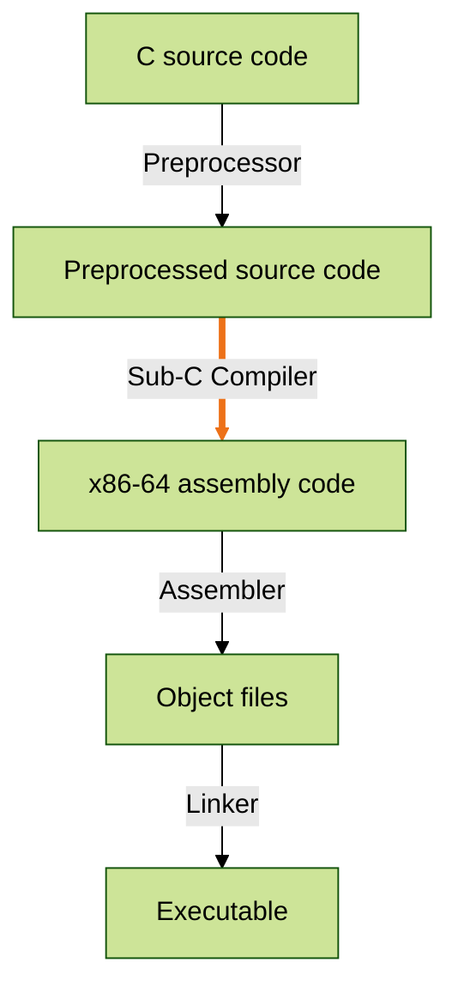

# Sub-C

A compiler for a large subset of the C programming language, implemented in OCaml. Inspired by the book [Writing a C Compiler](https://nostarch.com/writing-c-compiler), written by Nora Sandler.

## Supported C Language Features

### Expressions & Operators
- Integer constants
- Unary operators:
  - `-`, `~`
- Binary arithmetic operators:
  - `+`, `-`, `*`, `/`, `%`
- Logical operators:
  - `&&`, `||`, `!`
- Bitwise operators:
  - `&`, `|`, `^`, `<<`, `>>`
- Relational operators:
  - `==`, `!=`, `<`, `<=`, `>`, `>=`
- Conditional expressions (`a ? b : c`)
- Comma operator

### Statements & Control Flow
- `return`
- `if` / `else`
- Compound statements (`{ ... }`)
- Loops:
  - `while`
  - `do … while`
  - `for`
- `break` and `continue`
- `switch`, `case` and `default`
- `goto` and labelled statements

### Variables & Scope
- Local variable declarations
- Assignment (`=`)
- Compound assignment (`+=`, `-=`, `*=`, `/=`, `%=`)
- Bitwise compound assignment (`&=`, `|=`, `^=`, `<<=`, `>>=`)
- Lexical scoping rules
- Semantic analysis for:
  - Undeclared variables
  - Invalid control-flow usage

### Functions
- Definition of functions beyond `main`
- Function calls
- Argument passing
- Return values
- Type checking for function calls
- System V x86-64 calling convention

### File Scope Declarations
- File-scope variables
- `extern` and `static` storage-class specifiers
- Correct handling of:
  - Linkage
  - Storage duration
- Code generation for global data

## Not Yet Implemented (In Progress)

### Types Beyond `int`
- `long` integers
- Unsigned integer types
- Floating-point (`double`)
- Pointers (`*`, `&`)
- Arrays and pointer arithmetic
- Characters and strings
- `void`, `sizeof`, and dynamic memory allocation
- Structures (`struct`, `.`, `->`)

### Optimisation
- IR optimisations:
  - Constant folding
  - Dead store elimination
  - Unreachable code elimination
  - Copy propagation
- Register allocation
  - graph colouring
  - Register coalescing

## Unplanned Features

A line must be drawn somewhere, and it is therefore unlikely that the following important C language features will be implemented:
- Function pointers
- Variable-length argument lists
- `typedef`
- Type qualifiers like `const`

## Compilation Overview

## License

This software is released under the MIT license [MIT](LICENSE).

## Third-party Content

This project includes test cases derived from [github.com/nlsandler/writing-a-c-compiler-tests](https://github.com/nlsandler/writing-a-c-compiler-tests), licensed under the MIT License. See [test/tests/LICENSE.third_party](test_e2e/tests/LICENSE.third_party) for details.
